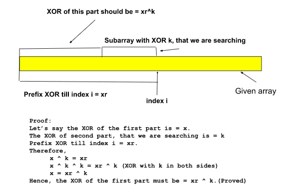

# Subarrays with XOR Equal to a Given Value

## Analysis

### Problem Statement

Given an array of integers `A` and an integer `B`, the task is to find the total number of subarrays having the bitwise XOR of all elements equal to `k`.



### Intuition

The brute-force approach involves generating all possible subarrays and calculating the XOR of each subarray to check if it equals `k`. However, this approach is inefficient and has a time complexity of O(N^3).

A more efficient approach utilizes the concept of prefix XOR. By maintaining a map to store the count of prefix XORs encountered so far, we can determine the number of subarrays with XOR equal to `k` efficiently.

### Approach

1. Initialize a variable `XOR` to 0 and a map `mpp` to store prefix XORs and their counts. Set `mpp[0]` to 1.
2. Initialize a variable `count` to 0 to store the count of subarrays with XOR equal to `k`.
3. Traverse the array `A`:
   - Update `XOR` by XORing it with the current element.
   - Calculate `x`, which represents the XOR value we need to achieve (`XOR ^ k`).
   - Add the count of `x` from the map `mpp` to the `count`.
   - Increment the count of the current prefix XOR `XOR` in the map `mpp`.
4. Return the final count.

### Time Complexity

The time complexity of this approach is O(N), where N is the size of the array `A`. This is because we traverse the array only once, and each operation inside the loop takes constant time.

### Space Complexity

The space complexity is also O(N) as we use a map `mpp` to store prefix XORs and their counts, which can grow up to the size of the array `A`.

## C++ Implementation

```cpp
#include <bits/stdc++.h>
using namespace std;

// Function to count the number of subarrays with XOR equal to a given target
int countNumberOfSubarraywithXORk(vector<int> a, int n, int target) {
    int XR = 0;
    map<int, int> mpp;
    mpp[XR]++; //{0,1}

    int count = 0;

    for (int i = 0; i < n; i++) {
        XR = XR ^ a[i];

        int x = XR ^ target;

        count += mpp[x];

        mpp[XR]++;
    }

    return count;
}

int main() {
    int n;
    cin >> n;

    vector<int> arr(n);
    for (int i = 0; i < n; i++) {
        cin >> arr[i];
    }

    int K;
    cin >> K;

    cout << "Printing Array Elements: " << endl;
    for (int i = 0; i < n; i++) {
        cout << arr[i] << " ";
    }
    cout << endl;

    cout << "Printing the count of subarrays with XOR equal to " << K << endl;
    cout << countNumberOfSubarraywithXORk(arr, n, K) << endl;
    return 0;
}
```

## Java Implementation

```java
import java.util.*;

public class SubarrayXOR {
    // Method to count the number of subarrays with XOR equal to a given target
    public static int countNumberOfSubarraywithXORk(int[] a, int n, int target) {
        int XR = 0;
        Map<Integer, Integer> map = new HashMap<>();
        map.put(XR, 1);

        int count = 0;

        for (int i = 0; i < n; i++) {
            XR ^= a[i];

            int x = XR ^ target;

            count += map.getOrDefault(x, 0);

            map.put(XR, map.getOrDefault(XR, 0) + 1);
        }

        return count;
    }

    public static void main(String[] args) {
        Scanner scanner = new Scanner(System.in);

        int n = scanner.nextInt();
        int[] arr = new int[n];
        for (int i = 0; i < n; i++) {
            arr[i] = scanner.nextInt();
        }

        int K = scanner.nextInt();

        System.out.println("Printing Array Elements: ");
        for (int i = 0; i < n; i++) {
            System.out.print(arr[i] + " ");
        }
        System.out.println();

        System.out.println("Printing the count of subarrays with XOR equal to " + K);
        System.out.println(countNumberOfSubarraywithXORk(arr, n, K));

        scanner.close();
    }
}
```

## Python Implementation

```python
def countNumberOfSubarraywithXORk(arr, n, target):
    XR = 0
    mpp = {0: 1}

    count = 0

    for i in range(n):
        XR ^= arr[i]

        x = XR ^ target

        count += mpp.get(x, 0)

        mpp[XR] = mpp.get(XR, 0) + 1

    return count

if __name__ == "__main__":
    n = int(input())
    arr = list(map(int, input().split()))
    K = int(input())

    print("Printing Array Elements:")
    print(*arr)

    print("Printing the count of subarrays with XOR equal to", K)
    print(countNumberOfSubarraywithXORk(arr, n, K))
```

## JavaScript Implementation

```javascript
// Function to count the number of subarrays with XOR equal to a given target
function countNumberOfSubarraywithXORk(arr, n, target) {
  let XR = 0;
  const map = new Map();
  map.set(XR, 1);

  let count = 0;

  for (let i = 0; i < n; i++) {
    XR ^= arr[i];

    const x = XR ^ target;

    count += map.get(x) || 0;

    map.set(XR, (map.get(XR) || 0) + 1);
  }

  return count;
}

// Main function
function main() {
  const readline = require("readline");
  const rl = readline.createInterface({
    input: process.stdin,
    output: process.stdout,
  });

  let n, arr, K;

  rl.question("Enter the size of the array: ", (size) => {
    n = parseInt(size);
    rl.question("Enter space-separated elements of the array: ", (elements) => {
      arr = elements.split(" ").map(Number);
      rl.question("Enter the target XOR value: ", (target) => {
        K = parseInt(target);

        console.log("Printing Array Elements:");
        console.log(...arr);

        console.log("Printing the count of subarrays with XOR equal to", K);
        console.log(countNumberOfSubarraywithXORk(arr, n, K));

        rl.close();
      });
    });
  });
}

// Invoke the main function
main();
```
